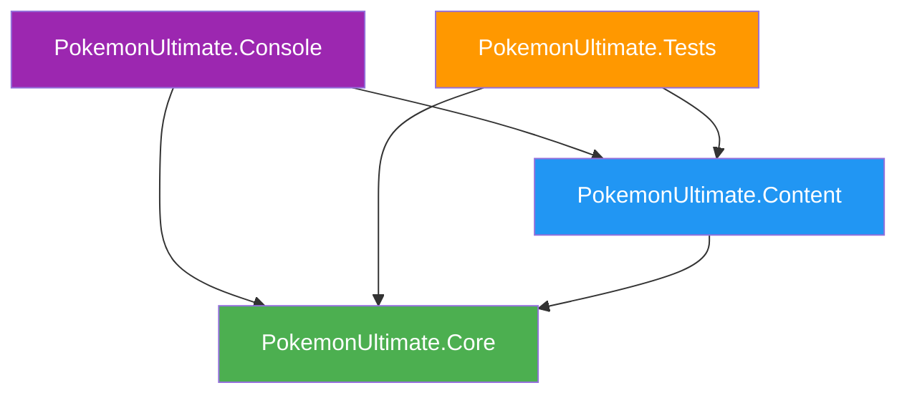

# Project Structure

## Overview
This document defines the solution architecture, project organization, namespace conventions, and dependency flow for the Pokemon Combat Game.

## Solution Structure

```
PokemonUltimate/
├── PokemonUltimate.Core/          → Generic game engine (logic only)
├── PokemonUltimate.Content/       → Concrete game data (Pokémon, Moves, etc.)
├── PokemonUltimate.Tests/         → Unit tests for Core + Content
├── PokemonUltimate.Console/       → Console application (for testing)
└── docs/                           → Architecture documentation
```

## Project Breakdown

### 1. PokemonUltimate.Core
**Target Framework**: `netstandard2.1`  
**Purpose**: Generic, reusable game engine with **zero** concrete content

#### Responsibilities
- ✅ Define **what** something is (e.g., `MoveData`, `PokemonSpeciesData`)
- ✅ Define **how** systems work (e.g., `DamagePipeline`, `TurnOrderResolver`)
- ✅ Provide **interfaces** for external systems (e.g., `IDataRegistry<T>`, `IPokemonRegistry`)
- ❌ **NEVER** contain concrete content (no "Pikachu", no "Ember")

#### Directory Structure
```
PokemonUltimate.Core/
├── Blueprints/                     → Static data models (immutable)
│   ├── PokemonSpeciesData.cs
│   ├── MoveData.cs
│   ├── BaseStats.cs
│   ├── LearnableMove.cs
│   ├── NatureData.cs
│   └── IIdentifiable.cs
├── Instances/                      → Runtime instances (mutable)
│   ├── PokemonInstance.cs          (Core: properties, constructor)
│   ├── PokemonInstance.Battle.cs   (Battle methods, HP, status)
│   ├── PokemonInstance.LevelUp.cs  (Level up, experience, moves)
│   ├── PokemonInstance.Evolution.cs (Evolution system)
│   └── MoveInstance.cs
├── Factories/                      → Instance creation
│   ├── PokemonInstanceBuilder.cs  (Fluent builder)
│   ├── PokemonFactory.cs          (Quick methods)
│   └── StatCalculator.cs          (Stat formulas)
├── Effects/                        → Move effects (IMoveEffect implementations)
│   ├── DamageEffect.cs
│   ├── StatusEffect.cs
│   └── StatChangeEffect.cs
├── Enums/                          → Game enumerations
│   ├── PokemonType.cs
│   ├── MoveCategory.cs
│   ├── Nature.cs
│   ├── Gender.cs
│   └── Stat.cs
├── Evolution/                      → Evolution system
│   ├── Evolution.cs
│   ├── IEvolutionCondition.cs
│   └── Conditions/
│       ├── LevelCondition.cs
│       └── ItemCondition.cs
└── Registry/                       → Data registry system
    ├── IDataRegistry.cs
    ├── IPokemonRegistry.cs
    ├── IMoveRegistry.cs
    └── GameDataRegistry.cs
```

### 2. PokemonUltimate.Content
**Target Framework**: `netstandard2.1`  
**Purpose**: Concrete game content (specific Pokémon and Moves)  
**Dependencies**: `PokemonUltimate.Core`

#### Responsibilities
- ✅ Define **which** Pokémon exist (e.g., Pikachu #25, Charizard #6)
- ✅ Define **which** Moves exist (e.g., Ember, Thunderbolt)
- ✅ Provide **builder tools** (DSL) for creating content easily
- ❌ **NEVER** contain game logic (no damage calculation, no turn order)

#### Directory Structure
```
PokemonUltimate.Content/
├── Builders/                       → DSL for content creation
│   ├── PokemonBuilder.cs          (Pokemon.Define("Pikachu", 25))
│   ├── MoveBuilder.cs             (Move.Define("Ember"))
│   ├── EffectBuilder.cs           (e => e.Damage().MayBurn(10))
│   ├── LearnsetBuilder.cs         (m => m.StartsWith(...))
│   └── EvolutionBuilder.cs        (e => e.AtLevel(16))
└── Catalogs/                       → Static content catalogs
    ├── Moves/                      (Organized by type)
    │   ├── MoveCatalog.cs         (Main + initialization)
    │   ├── MoveCatalog.Fire.cs    (Fire-type moves)
    │   ├── MoveCatalog.Water.cs   (Water-type moves)
    │   └── MoveCatalog.Electric.cs
    └── Pokemon/                    (Organized by generation)
        ├── PokemonCatalog.cs      (Main + initialization)
        └── PokemonCatalog.Gen1.cs (Kanto Pokémon #1-151)
```

### 3. PokemonUltimate.Tests
**Target Framework**: `net8.0`  
**Purpose**: Unit tests for both Core and Content  
**Dependencies**: `PokemonUltimate.Core`, `PokemonUltimate.Content`, `NUnit`

#### Responsibilities
- ✅ Test **Core logic** (TDD required)
- ✅ Validate **Content integrity** (all Pokémon have valid stats, etc.)
- ✅ Verify **Content composition** (Ember has DamageEffect + BurnEffect)

#### Directory Structure
```
PokemonUltimate.Tests/
├── Builders/                       → Builder tests
├── Catalogs/                       → Catalog tests
│   ├── Moves/
│   └── Pokemon/
├── Effects/                        → Effect tests
├── Evolution/                      → Evolution tests
├── Models/                         → Model tests
└── Registry/                       → Registry tests
```

### 4. PokemonUltimate.Console
**Target Framework**: `net8.0`  
**Purpose**: Console application for testing game logic without Unity  
**Dependencies**: `PokemonUltimate.Core`, `PokemonUltimate.Content`

---

## Namespace Conventions

### Core Namespaces
All Core code uses the `PokemonUltimate.Core.*` namespace:

```csharp
PokemonUltimate.Core.Blueprints      // PokemonSpeciesData, MoveData, BaseStats
PokemonUltimate.Core.Instances       // PokemonInstance, MoveInstance
PokemonUltimate.Core.Factories       // PokemonFactory, PokemonInstanceBuilder, StatCalculator
PokemonUltimate.Core.Effects         // DamageEffect, StatusEffect
PokemonUltimate.Core.Enums           // PokemonType, MoveCategory, Nature, Gender
PokemonUltimate.Core.Evolution       // Evolution, IEvolutionCondition
PokemonUltimate.Core.Registry        // IDataRegistry, PokemonRegistry
```

### Content Namespaces
All Content code uses the `PokemonUltimate.Content.*` namespace:

```csharp
PokemonUltimate.Content.Builders           // Pokemon, Move, Effect builders
PokemonUltimate.Content.Catalogs.Moves     // MoveCatalog (partial classes)
PokemonUltimate.Content.Catalogs.Pokemon   // PokemonCatalog (partial classes)
```

### Test Namespaces
Tests mirror the structure they test:

```csharp
PokemonUltimate.Tests.Models         // Tests for Core.Models
PokemonUltimate.Tests.Catalogs.Moves // Tests for Content.Catalogs.Moves
```

---

## Dependency Flow



### Dependency Rules
1. ✅ **Content → Core**: Content depends on Core (uses Models, Enums, Builders)
2. ✅ **Tests → Core + Content**: Tests can reference both
3. ✅ **Console → Core + Content**: Console can use both
4. ❌ **Core → Content**: Core must NEVER know about Content
5. ❌ **Core → Tests**: Core must NEVER depend on Tests

---

## File Organization Guidelines

### Catalog Files (Partial Classes)
Catalogs are split using `partial class` to keep files small and focused:

#### MoveCatalog Example
```
MoveCatalog.cs              → Main catalog (All, Count, RegisterAll)
MoveCatalog.Fire.cs         → Fire-type moves (Ember, Flamethrower, Fire Blast)
MoveCatalog.Water.cs        → Water-type moves (Water Gun, Surf, Hydro Pump)
MoveCatalog.Electric.cs     → Electric-type moves (Thunder Shock, Thunderbolt)
```

**Rule**: Each file should be **50-200 lines max**. If it grows, split it further.

#### PokemonCatalog Example
```
PokemonCatalog.cs           → Main catalog (All, Count, RegisterAll)
PokemonCatalog.Gen1.cs      → Kanto Pokémon (#1-151)
PokemonCatalog.Gen2.cs      → Johto Pokémon (#152-251) [future]
```

#### PokemonInstance Example (Runtime Class)
```
PokemonInstance.cs          → Core properties, constructor (277 lines)
PokemonInstance.Battle.cs   → Battle methods, damage, healing (199 lines)
PokemonInstance.LevelUp.cs  → Level up, experience, move learning (293 lines)
PokemonInstance.Evolution.cs → Evolution queries and execution (227 lines)
```

**Note**: Runtime classes can also use partial classes to organize by responsibility.

---

## Adding New Content

### Adding a New Move
1. Navigate to `PokemonUltimate.Content/Catalogs/Moves/`
2. Find the appropriate type file (e.g., `MoveCatalog.Fire.cs`)
3. Add your move using the `Move` builder:
   ```csharp
   public static readonly MoveData Inferno = Move.Define("Inferno")
       .Description("The user attacks by engulfing the target in an intense fire.")
       .Type(PokemonType.Fire)
       .Special(100, 50, 5)
       .WithEffects(e => e
           .Damage()
           .MayBurn(100))
       .Build();
   ```
4. Register it in the `RegisterFire()` method:
   ```csharp
   static partial void RegisterFire()
   {
       _all.Add(Ember);
       _all.Add(Flamethrower);
       _all.Add(Inferno);  // ← Add here
   }
   ```

### Adding a New Pokémon
1. Navigate to `PokemonUltimate.Content/Catalogs/Pokemon/`
2. Open the appropriate generation file (e.g., `PokemonCatalog.Gen1.cs`)
3. Add your Pokémon using the `Pokemon` builder:
   ```csharp
   public static readonly PokemonSpeciesData Arcanine = Builders.Pokemon.Define("Arcanine", 59)
       .Type(PokemonType.Fire)
       .Stats(90, 110, 80, 100, 80, 95)
       .Moves(m => m
           .StartsWith(Moves.MoveCatalog.Ember)
           .AtLevel(34, Moves.MoveCatalog.Flamethrower))
       .Build();
   ```
4. Register it in `RegisterGen1()`:
   ```csharp
   static partial void RegisterGen1()
   {
       // ... other Pokémon
       _all.Add(Arcanine);
   }
   ```

---

## Future Expansion

As the project grows, consider these additional projects:

### PokemonUltimate.Battle (when implementing combat)
**Purpose**: Battle engine, damage calculation, turn order  
**Dependencies**: `Core`

### PokemonUltimate.Unity (when integrating Unity)
**Purpose**: MonoBehaviour, UI, animations, scenes  
**Dependencies**: `Core`, `Content`, `Battle`

### PokemonUltimate.Abstractions (optional)
**Purpose**: Public interfaces only (for plugin support)  
**Dependencies**: None

---

## Key Principles

1. **Core is Generic**: Think "Chess Engine", not "Chess Game". Core should work for any turn-based RPG, not just Pokémon.
2. **Content is Specific**: Think "Chess Pieces". Content defines Pikachu, Charizard, Thunderbolt.
3. **Tests Mirror Structure**: If you add a file to Core, create a corresponding test file.
4. **Dependency Inversion**: Content depends on Core, never the reverse.
5. **Partial Classes for Scalability**: Keep files small (50-200 lines). Split when they grow.

---

## References

- [Project Guidelines](../project_guidelines.md) - Core philosophy and coding standards
- [Data Loading System](./data_loading_system.md) - Registry pattern details
- [Catalogs System](./catalogs_system.md) - Partial class organization
